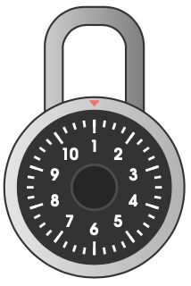

# Rotary Lock (Chapter 1)

Note: Chapter 2 is a harder version of this puzzle.

You're trying to open a lock.
The lock comes with a wheel which has the integers from `1` to `N` arranged in a circle in order around it
(with integers `1` and `N` adjacent to one another).
The wheel is initially pointing at `1`.

For example,
the following depicts the lock for `N=10`
(as is presented in the second sample case).



It takes `1` second to rotate the wheel by `1` unit to an adjacent integer in either direction,
and it takes no time to select an integer once the wheel is pointing at it.

The lock will open if you enter a certain code.
The code consists of a sequence of `M` integers,
the `i-th` of which is `C_i`.
Determine the minimum number of seconds required to select all `M` of the code's integers in order.

Please take care to write a solution which runs within the time limit.

## Constraints

- `3 <= N <= 50,000,000`
- `1 <= M <= 1,000`
- `1 <= C_i <= N`

## Samples

### 1

```
N = 3
M = 3
C = [1, 2, 3]

Expected Return Value = 2
```

In the first case,
there are `3` integers on the lock,
and the sequence of integers to be selected is `[1,2,3]`.
One optimal way to enter the code is:

1. select `1`
1. rotate to `2` (1 second)
1. select `2`
1. rotate to `3` (1 second)
1. select `3`

The total time taken is `1+1=2` seconds.

### 2

```
N = 10
M = 4
C = [9, 4, 4, 8]

Expected Return Value = 11
```

Sample Explanation

In the second case,
the lock consists of the integers `1` through `10`,
and the sequence to be selected is `[9,4,4,8]`.
One optimal way to enter the code is:

1. rotate from `1` backwards to `9` (2 seconds)
1. select `9`
1. rotate forwards to `4` (5 seconds)
1. select `4` twice
1. rotate forwards to `8` (4 seconds)
1. select `8`

The total time taken is `2+5+4=11` seconds.
