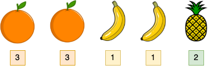

# Question 1

Amazon recently launched a new game, Fruit Crush!
In this game, you are allowed to choose two dissimilar fruits and crush them.
Each type of fruit is represented as an integer in an array.
Formally you can choose any two unequal integers in the array and delete them.

Given an array `fruits` of size `n`, return the minimum possible number of fruits left after the given operation is performed any number of times.

## Example

```
n = 5
fruits = [3, 3, 1, 1, 2]
```



Fruits 1 (banana) and 2 (pineapple) can be crushed first, followed by numbers 1 (banana) and 3 (orange).
Only 3 (orange) remains in the array, hence the answer is 1.

## Function Description

Complete the function `getMinimumFruits` in the editor below.

`getMinimumFruits` has the following parameter(s):

- `int fruits[n]`:
array of `n` fruits

Returns

- `int`:
the minimum possible count of fruits left

## Constraints

- `1 <= n <= 1e5`
- `1 <= fruits[i] <= 1e9`
