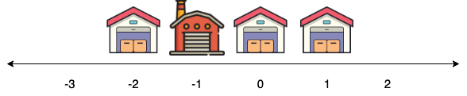
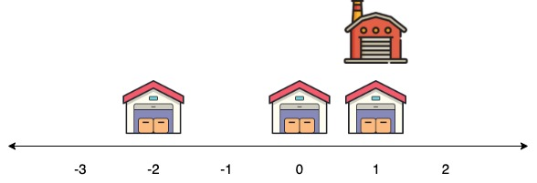

# Question 2

Amazon has multiple delivery centers and delivery warehouses all over the world!
The world is represented by a number line from `-1e9` to `1e9`.
There are `n` delivery centers, the `i`-th one at location `center[i]`.
A location `x` is called a suitable location for a warehouse if it is possible to bring all the products to that point by traveling a distance of no more than `d`.
At any one time, products can be brought from one delivery center and placed at point `x`.
Given the positions of `n` delivery centers, calculate the number of suitable locations in the world.
That is, calculate the number of points `x` on the number line (`-1e9 <= x <= 1e9`) where the travel distance required to bring all the products to that point is less than or equal to `d`.

Note:
The distance between point `x` and `center[i]` is `|x - center[i]|`, their absolute difference.

## Example

Given `n = 3, center = [-2, 1, 0], d = 8`:

The various locations along with the distance traveled to bring all treasures at that point are

- Locate the warehouse at `x = -3`:
First bring products from `center[0] = -2` covering a distance of `|-3 - (-2)| = 1` to reach the center and `|-3 - (-2)| = 1` to return.
Similarly we bring products from centers `1` and `2` to point `-3` for total distance of `1 + 1 + 4 + 4 + 3 + 3 = 16` which is > `d`.
This is not a suitable location.

    

- Locate the warehouse at `x = 0`, total distance traveled is `2 * |0 - (-2)| + 2 * |0 - 1| + 2 * |0 - 0| = 6 <= d`.
This is a suitable location.

    

- Locate the warehouse at `x = -1`, total distance traveled is `2 * |-1 - (-2)| + 2 * |-1 - 1| + 2 * |-1 - 0| = 8 <= d`.
This is a suitable location.

    

- Locate the warehouse at `x = 1`, total distance traveled is `2 * |1- (-2)| + 2 * |1 - 1| + 2 * |1 - 0| = 8 <= d`.
This is a suitable location.

    

The only suitable locations are `{-1, 0, 1}`.
Return `3`.

## Function Description

Complete the function `suitableLocations` in the editor below.

`suitableLocations` has the following parameters:

- `int center[n]`:
the positions of delivery centers
- `long d`:
the maximum total travel distance for a suitable location

Returns

- `int`:
the number of suitable locations.

## Constraints

- `1 <= n <= 1e5`
- `-1e9 <= center[i] <= 1e9`
- `0 <= d <= 1e15`
